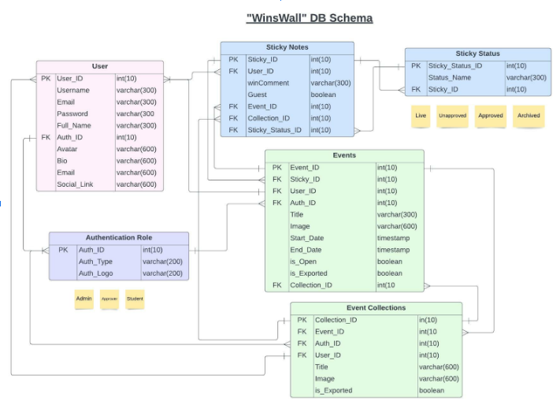
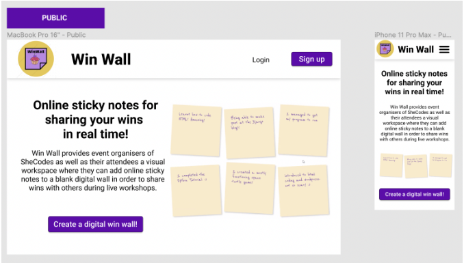
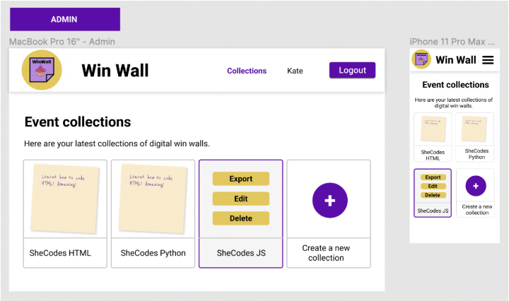
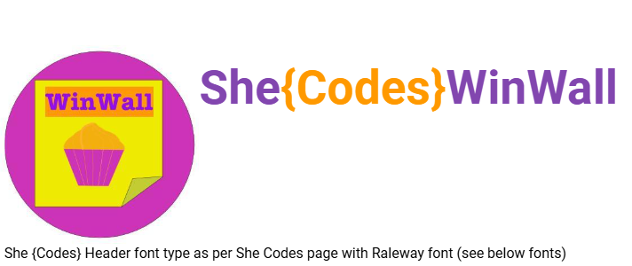
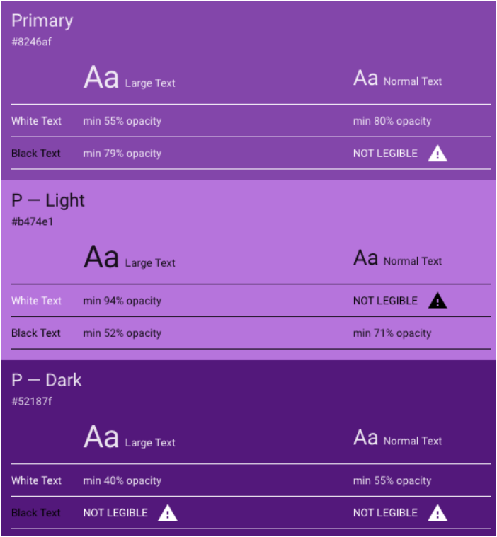
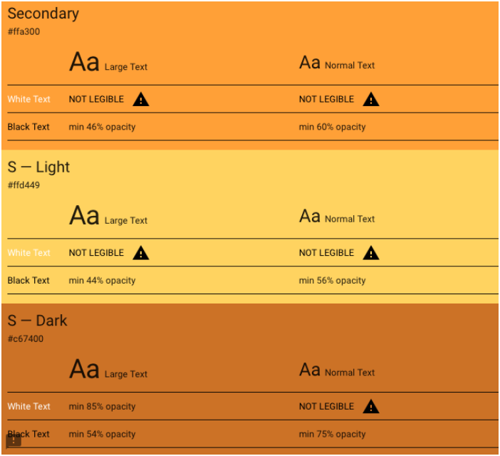
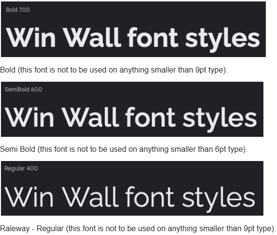

# Your Product Name
> Your Group Name

> [!NOTE]
> This repo has been shared with your group. Use it to develop your group project.
>
> Your group will have received two identical repos - one for your project's back-end, and another for the front-end. Although they are identical right now they are about to diverge, because you'll be using one to create a DRF project and the other to create a React project!

> [!IMPORTANT]  
> Use this `README.md` file to document your MVP using Markdown. Feel free to duplicate the product description aspects between the front-end README and the back-end README, but consider splitting out the technical design aspects to the specific repo that implements them. 
>
> An example MVP spec (containing both front- and back-end descriptions) is set out below - you should replace it with your own content! (Remember to delete any "admonition" blocks like this `IMPORTANT` section, the `CAUTION` and `NOTE` sections, etc.)

> [!CAUTION]  
> In order to set up your project, **one** member of the group should clone this repo down, initialise a new React/DRF project, commit, and push. 
>
> If more than one group member performs the setup, you'll have Git problems. Check out [the Git collaboration content](https://github.com/SheCodesAus/PlusLessonContent?tab=readme-ov-file#26---group-project) for more on how to use Git as a team.

## Table of Contents

- [Your Product Name](#your-product-name)
  - [Table of Contents](#table-of-contents)
  - [Mission Statement](#mission-statement)
  - [Features](#features)
    - [Summary](#summary)
    - [Users](#users)
    - [Sticky Notes](#sticky-notes)
    - [Collections](#collections)
    - [Pages/Endpoint Functionality](#pagesendpoint-functionality)
    - [Nice To Haves](#nice-to-haves)
  - [Technical Implementation](#technical-implementation)
    - [Back-End](#back-end)
    - [Front-End](#front-end)
    - [Git \& Deployment](#git--deployment)
  - [Target Audience](#target-audience)
  - [Back-end Implementation](#back-end-implementation)
    - [API Specification](#api-specification)
    - [Object Definitions](#object-definitions)
      - [Users](#users-1)
      - [Sticky Notes](#sticky-notes-1)
    - [Database Schema](#database-schema)
  - [Front-end Implementation](#front-end-implementation)
    - [Wireframes](#wireframes)
      - [Home Page](#home-page)
      - [Collection List Page](#collection-list-page)
    - [Logo](#logo)
    - [Colours](#colours)
      - [Primary](#primary)
      - [Secondary](#secondary)
    - [Font](#font)


## Mission Statement

> [!NOTE]  
> What is the purpose of your project? (approx 100-200 words). Example below.

Win-Wall is an online collaboration tool that provides organisers of SheCodes workshops as well as their attendees a visual workspace where they can add digital sticky notes to a blank digital wall in order to share wins with others during live events.
This tool offers an unlimited number of digital win walls which are organised by event collection in order to facilitate collaboration during live events and easily bring all attendees’ wins to light in real time.
Win-Wall comes packed full of features such as the ability to share a unique digital win wall to a live audience, easily approve and export win wall messages to upload on a WordPress website, manage user roles to give event organisers and attendees access to different functionalities, and many more.

## Features

> [!NOTE]  
> Tell me the features your website will and will not have. Give detailed explanations, this is where you define the scope of your project. Example below.


### Summary 
Provide Guest users ability to post sticky notes to a live event board. Once posted, users can view all posts for live event. Admin and approver access will allow events boards to be created, sticky notes to be edited, approved and exported.

### Users

| Type               | Access                                                                                                                                                                                                                                                                                             | Role type assignment                                |
| :----------------- | :------------------------------------------------------------------------------------------------------------------------------------------------------------------------------------------------------------------------------------------------------------------------------------------------- | :-------------------------------------------------- |
| Superuser or admin | <br> - All access   <br> - Can log in  <br> - Can log out  <br> - Create and manage events  <br> - Create and manage collections  <br> - Create and manage other users  <br> - Approve, archive and edit notes  <br> - Export notes as CSV  <br> - Can See and edit their details via profile page | Kate                                                |
| Approver           | <br> - Can log in  <br> - Can log out  <br> - Approve, archive and edit notes  <br> - Can See and edit their details via profile page                                                                                                                                                              | Mentors, volunteers, shecodes11507 staff            |
| Guest              | <br> - Create post it notes  <br> - Submit post it notes  <br> - View Live event board with all post it notes  <br> - can post with and without including their name                                                                                                                               | Public: Users who attend events, workshops, courses |

### Sticky Notes

| Feature                                        | Access                                                                                                                                                                                                           | Notes/Conditions                                                                                              |
| :--------------------------------------------- | :--------------------------------------------------------------------------------------------------------------------------------------------------------------------------------------------------------------- | :------------------------------------------------------------------------------------------------------------ |
| Create                                         | Can be created by anyone with URL                                                                                                                                                                                | <br> - Limit length of sticky note text  <br> - option to add hashtag (TBC: as main text or additional field) |
| Post                                           | Post as Guest                                                                                                                                                                                                    | <br> - Submits Sticky note to Live event board                                                                |
| View                                           | Guests, Approvers and Admin can view posts via Live event board Admin and Approvers can view once status updated from Live                                                                                       |                                                                                                               |
| Edit                                           | Can be edited by Admin and Approvers                                                                                                                                                                             | <br> - Edit sticky note text, eg: for spelling errors before Status is set to approved                        |
| Statuses: Live, Unapproved, Approved, Archived | <br> - Auto status of notes will be ‘live’ based on linked event  <br> - Auto status of notes will be unapproved based on closure of linked event  <br> - Update to Approved and Archived by Admin and Approvers |                                                                                                               |
| Export                                         | <br> - Export as Admin only                                                                                                                                                                                      | <br> - CSV file  <br> - Format: collection, event, sticky note text                                           |
| Flag- Is Exported                              | <br> - Auto flag based on whether Admin has exported the sticky note                                                                                                                                             | <br> - Boolean                                                                                                |
| Link to Collection                             | <br> - Controlled by Admin                                                                                                                                                                                       | <br> - Based on type of event, eg: shecodes flash, plus, other event types.                                   |
| Link to Event                                  | <br> - Auto link based on event URL  <br> - Link to event can be edited by Admin                                                                                                                                 |                                                                                                               |
| Link to Approver                               | <br> - Controlled by Admin and Approver who creates the event                                                                                                                                                    | <br> - Approver is User who is managing or associated with admin of the event                                 |

### Collections

| Feature                           | Access                     | Notes/Conditions           |
| :-------------------------------- | :------------------------- | :------------------------- |
| Assign events to a collection     | <br> - Based on event type |                            |
| Assign approver to a collection   | <br> - admin               |                            |
| Default event board live duration | <br> - Admin               | <br> - Based on event type |
| View event boards by collection   | <br> - Admin, Approver     |                            |
| Export notes by Collection        | <br> - Admin               |                            |

### Pages/Endpoint Functionality

| Endpoint              | functionality                                                                                                                                                                     | comments                                                                                         |
| :-------------------- | :-------------------------------------------------------------------------------------------------------------------------------------------------------------------------------- | :----------------------------------------------------------------------------------------------- |
| Create and post notes | <br> - Available to anyone with URL   <br> - Add sticky notes   <br> - Post sticky notes                                                                                          | <br> - Sticky note ‘feel’ is preferred  <br> - Easy to read and accessible  <br> - Good contrast |
| Event board           | <br> - Once note is posted, redirect to live session  notes  <br> - Able to post more notes (redirect back or add directly?)  <br> - Live session ends at midnight – day of event | <br> - view live notes  <br> - search notes by text/hashtag                                      |
| Admin page            | All admin functions  <br> - can also create another admin account                                                                                                                 | <br> - Requires auth  <br> - initial admin created by DB                                         |
| Register as Approver  | <br> - users can register as approvers  <br> - once registered, approver can log in                                                                                               | Requires shecodes email address to be used                                                       |
| Approver page         | Approver functions                                                                                                                                                                | Requires auth Easy to read, accessible, easy to use for new users                                |
| Profile page          | <br> - All registered users  <br> - Can view their personal info  <br> - Can update their info                                                                                    | Requires auth                                                                                    |

### Nice To Haves

- Register during or after event; Sign up for additional events: Email address, Name, Event
- History of my own notes as Registered user
- Events I have registered for as Registered user
- Be able to edit my own notes – as Registered user but only until its been approved
- Bulk update sticky note status
- QR code generation 
- Use QR codes to access event as guest

## Technical Implementation

> [!NOTE]  
> What languages and frameworks will you be using? What kind of database will you be using? How will you deploy the website? Example Below.

### Back-End

- Django / DRF API
- Python

### Front-End

- React / JavaScript
- HTML/CSS

### Git & Deployment
- Heroku
- Netlify
- GitHub

This application's back-end will be deployed to Heroku. The front-end will be deployed separately to Netlify.
 
We will also use Insomnia to ensure API endpoints are working smoothly (we will utilise a local and deployed environment in Insomnia).

## Target Audience

> [!NOTE]  
> Who is the website for? (approx 100 words). Example below.

This website has two major target audiences: She Codes ‘Leaders, Volunteers & Mentors’, and ‘She Coders’ joining the one-day/short-term workshops. 

**She Codes Leaders, Volunteers and Mentors** (administrators) will use this website to assign one-day workshop coders to specific events and/or collections where they can fill-out a “sticky note” win and paste it on the WinsWall. The administrators will then be able to sort, authorise and delete these stickies and easily download the data in a CSV file. This website is targeted towards this group in order to automate a normally menial task.

**She Coders** (laypeople) will use this website to post their Win on a WinWall board, keep track of what events they’ve attended and also view previously written wins. This website is targeted to this group in order to prevent loss of paper data (physical sticky notes) and also make the WinsWall more interactive.

## Back-end Implementation
### API Specification

| HTTP Method | URL                                 | Purpose                                                                                                                                  | Request Body                                                                                                       | Successful Response Code | Authentication and Authorization                      |
| :---------- | :---------------------------------- | :--------------------------------------------------------------------------------------------------------------------------------------- | :----------------------------------------------------------------------------------------------------------------- | :----------------------- | :---------------------------------------------------- |
| POST        | /login                              | Allow users to log in                                                                                                                    | ““Username”:”string”, “password”:”string”                                                                          | 200                      | Token auth                                            |
| POST        | /logout                             | Allow users to log out ( end active session)                                                                                             | ““Username”:”string”, “password”:”string”                                                                          | 200                      | Will clear user log in session \- remove stored token |
| POST        | /Register                           | Create new student or approver user                                                                                                      | “Username”:”string”, “FullName”: “string” “Email”:”string”,”Password”:”string”, ”Password2”:”string”,              | 201                      | Admin                                                 |
| PUT         | /Profile/ID                         | Edit user                                                                                                                                | “Username”:”string”, “FullName”: “string” “Email”:”string”, “Avatar”:”string”,  “Bio”:”string”, “Socials”:”string” | 200                      | Admin, approver or student with matching ID           |
| GET         | /Profile/ID                         | View User profile                                                                                                                        | NA                                                                                                                 | 200                      | Any                                                   |
| DELETE      | /User/ID                            | Delete user                                                                                                                              | NA                                                                                                                 | 204                      | Admin, approver or student with matching ID           |
| POST        | /EventCollection                    | Create new Event Collection                                                                                                              | “Title”:”string”, “IsExported”:”boolean” “Approver”: integer                                                       | 201                      | Admin                                                 |
| PUT         | /EventCollection/Id                 | Update Event collection                                                                                                                  | “Title”:”string”, “IsExported”:”boolean”                                                                           | 200                      | Admin, Approver linked to event?                      |
| DELETE      | /EventCollection/Id                 | Delete Event collection                                                                                                                  | NA                                                                                                                 | 204                      | Admin                                                 |
| POST        | /EventBoard/                        | Create new Event board                                                                                                                   | “Title”: “string”, “StartDate”:”datetime”, “EndDate:”datetime”                                                     | 201                      | Admin, approvers                                      |
| PUT         | /EventBoard/ID                      | Update Event board                                                                                                                       | “Title”: “string”, “StartDate”:”datetime”, “EndDate:”datetime”                                                     | 200                      | Admin, approvers                                      |
| DELETE      | /EventBoard/ID                      | Delete Event board                                                                                                                       | NA                                                                                                                 | 204                      | Admin or author of event                              |
| GET         | /EventBoard/ID                      | Get Event board details                                                                                                                  | NA                                                                                                                 | 200                      | Open access                                           |
| POST        | /stickyNote/                        | Create a new sticky note as Guest user                                                                                                   | “WinComment”:”string”                                                                                              | 201                      | Open access                                           |
| GET         | /stickyNotes/?Status=Live\&Event.ID | Get Sticky notes for an event  Use query params to filter by event ID and Status                                                         | NA                                                                                                                 | 200                      | Open access                                           |
| GET         | /stickyNotes/?Event.ID              | Get Sticky notes for an event                                                                                                            | NA                                                                                                                 | 200                      | Admin, approvers                                      |
| GET         | /stickyNotes/                       | Export sticky notes as CSV (eg:response.setContentType("text/csv")) Can optionally filter by: event ID, Status, isexported, collectionId | NA                                                                                                                 | 200                      | Admin                                                 |
| PUT         | /stickyNotes/ID                     | Edit sticky note, update status of sticky note to Approved or Archived                                                                   | “WinComment”:”string”                                                                                              | 200                      | Admin, approvers                                      |
| POST        | /StickyStatus                       | Create available statuses for stickyNotes                                                                                                | “StatusName”:”string”                                                                                              | 201                      | Admin                                                 |
| GET         | /StickyStatus                       | Get all statuses                                                                                                                         | NA                                                                                                                 | 200                      | Admin                                                 |

### Object Definitions

> [!NOTE]  
> Define the actual objects that your API returns. The example GET method above says it returns “all projects”, so we need to define what a “project” looks like. Example below.

#### Users
| Field              | Data type |
| :----------------- | :-------- |
| *User\_ID (PK)*    |           |
| *Username*         | string    |
| FullName           | string    |
| *Email*            | string    |
| *Password*         | string    |
| *Password2*        | string    |
| Auth\_ID (FK)      | integer   |
| StickyNoteId (FK)  | integer   |
| Event\_Id (FK)     | integer   |
| Collection\_Id(FK) | integer   |
| Avatar             | string    |
| Bio                | string    |
| SocialLink         | string    |

#### Sticky Notes
| Field                   | Data Type |
| :---------------------- | :-------- |
| Sticky\_ID (PK)         | integer   |
| WinComment              | string    |
| Guest                   | boolean   |
| UserId (FK)             | integer   |
| Event\_Id (FK)          | integrer  |
| Collection\_Id (FK)     | integrer  |
| Sticky\_Status\_ID (FK) | integrer  |

> [!NOTE]  
> ... etc

### Database Schema
> [!NOTE]  
> Insert an image of your database schema (could be a photo of a hand-drawn schema or a screenshot of a schema created using a tool such as ​​https://drawsql.app/). Example below.



## Front-end Implementation

### Wireframes

> [!NOTE]  
> Insert image(s) of your wireframes (could be a photo of hand-drawn wireframes or a screenshot of wireframes created using a tool such as https://www.mockflow.com/).

See all wireframes and how Admins, Approvers and Students would see the Win Wall website: https://www.figma.com/file/cvP0Kc7lAX39Fvo12C5aLa/Win-Wall?node-id=22%3A1345 

#### Home Page


#### Collection List Page


> [!NOTE]  
> etc...

### Logo


### Colours
#### Primary



#### Secondary



### Font

(We will create a ‘highlight-text’ font style in CSS with the glow effect as per the above - to use on hero section)
Raleway
Google fonts:

```css
@import url('https://fonts.googleapis.com/css2?family=Raleway:wght@400;600;700&display=swap');
font-family: 'Raleway', sans-serif;
```
(When Raleway is not available the standard font to be used is the Calibri font family)

